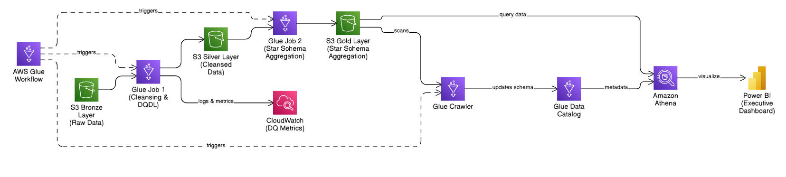
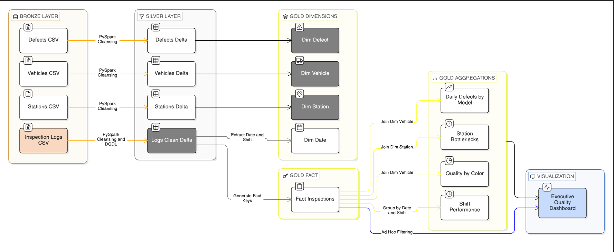
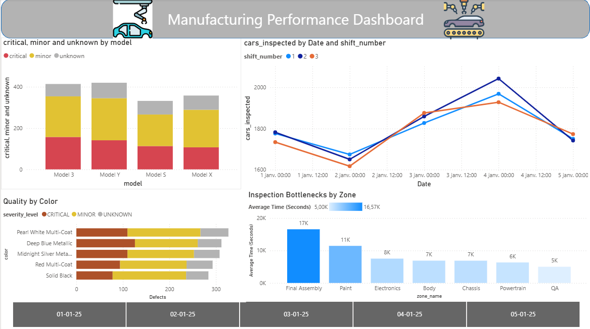

# 🏭 Enterprise Manufacturing Quality Lakehouse & Analytics Pipeline

### **Project Overview**
Architected and developed a fully automated end-to-end data pipeline, orchestrated via **AWS Glue Workflows**, using PySpark to process manufacturing inspection logs. Implementing a Medallion Lakehouse Architecture (Bronze, Silver, Gold), the platform transforms raw, messy factory floor data into a highly optimized Star Schema using the Delta Lake format. 

The resulting data marts are cataloged via **AWS Glue Crawlers** and queried via **Amazon Athena** to power a synchronized, real-time executive Power BI dashboard for plant managers to track vehicle defects, shift performance, and production bottlenecks.

---

## 🏗️ Cloud Architecture


---

## 📊 Data Lineage & ETL Flow


---

## 🛠️ Data Architecture & ETL Pipeline

### **Phase 0: Data Profiling & Exploration**
* **Exploratory Data Analysis (EDA):** Before building the automated pipeline, conducted deep-dive data profiling using a Jupyter Notebook (`data_exploration.ipynb`). 
* **Anomaly Detection:** Identified critical data quality issues in the raw factory logs, including missing defect codes, inconsistent string casing, impossible negative inspection durations, and varying timestamp formats. This analysis directly informed the cleansing logic used in the PySpark ETL jobs.

### **1. Bronze Layer (Raw Data Ingestion)**
* **S3 Storage (`/bronze`):** Ingested raw, untyped CSV files into the `s3://.../bronze/` directory representing core manufacturing domains: `vehicles` (metadata), `stations` (factory zones), `defects` (reference codes), and `inspection_logs` (transactional events).

### **2. Silver Layer (Data Cleansing & Quality Enforcement)**
* **S3 Storage (`/silver`):** Transformed, cleansed, and validated data is written to the `s3://.../silver/` directory in Delta Lake format.
* **PySpark Transformations:** Engineered robust data cleansing scripts to standardize the transactional logs. This included:
    * Imputing missing defect codes with 'NONE'.
    * Standardizing casing and dynamically cross-referencing incoming defect IDs against the master reference table, automatically flagging orphaned codes as 'UNKNOWN'.
    * Applying absolute values to correct erroneous negative inspection durations.
    * Developing a fallback timestamp parser (`coalesce`) to seamlessly handle multiple date-time formats.
* **Automated Data Quality (DQDL):** Integrated AWS Glue Data Quality to evaluate data health before loading to Silver. Implemented strict rulesets to guarantee completeness, ensure 17-character VIN lengths, and enforce non-negative time values, publishing metrics directly to AWS CloudWatch.

### **3. Gold Layer (Star Schema & Business Aggregations)**
* **S3 Storage (`/gold`):** Final business-level tables are written to the `s3://.../gold/` directory, optimized for BI consumption.
* **Dimensional Modeling:** Transformed the flat, normalized Silver tables into a query-optimized Star Schema:
    * **Fact Table:** `fact_inspections` storing highly granular, deduplicated inspection events with derived Date/Shift keys and boolean defect flags.
    * **Dimension Tables:** `dim_vehicle`, `dim_station`, `dim_defect`, and a custom-built `dim_date`.
* **Pre-Calculated Data Marts:** Engineered complex PySpark aggregations to serve the BI layer instantly:
    * `agg_daily_defects_by_model`: Defect severity pivots (Critical vs. Minor) by vehicle model.
    * `agg_station_bottlenecks`: Min, max, and average processing times grouped by factory zone and shift.
    * `agg_quality_by_color`: Defect counts isolated by paint color.
    * `agg_shift_performance`: High-level Plant Manager KPIs tracking total cars inspected vs. defective rates per shift.

### **4. Data Cataloging & Ad-Hoc Analysis**
* **AWS Glue Crawlers & Data Catalog:** Configured AWS Glue Crawlers to scan the `/gold` S3 directory, automatically inferring the schema of the Delta tables and registering them into the **AWS Glue Data Catalog**.
* **Amazon Athena (Serverless SQL):** Leveraged Amazon Athena to perform serverless, ad-hoc SQL querying directly against the Glue Catalog tables for rapid data validation and analytical querying.

### **5. Pipeline Orchestration & Automation**
* **AWS Glue Workflows:** Designed and deployed an event-driven orchestration workflow to automate the entire ETL lifecycle. The workflow logically sequences the jobs, triggering the Silver-to-Gold build immediately upon the successful completion and DQ validation of the Bronze-to-Silver job.

---

## 📈 Executive Power BI Dashboard


---

## 💻 Tech Stack & Tools
* **Cloud & Storage:** Amazon S3, Amazon CloudWatch
* **Data Processing:** AWS Glue, Apache Spark (PySpark), Python, SQL
* **Data Catalog & Orchestration:** AWS Glue Data Catalog, AWS Glue Crawlers, AWS Glue Workflows
* **Query Engine:** Amazon Athena
* **Storage Format:** Delta Lake (ACID compliance)
* **Data Quality:** AWS Glue Data Quality (DQDL)
* **Visualization:** Power BI

---

## 📂 Repository Structure
```text
manufacturing-quality-lakehouse/
│
├── assets/
│   └── data_exploration.ipynb    # Data profiling and anomaly detection
│
├── src/                          
│   ├── bronze_to_silver.py       # PySpark cleansing and DQDL script
│   └── silver_to_gold.py         # PySpark Star Schema & Aggregations script
│
├── images/                       # Architecture diagrams and dashboard screenshots
│   ├── architecture_diagram.png
│   ├── data_lineage.png
│   └── power_bi_dashboard.png
│
└── README.md                     # Project documentation
